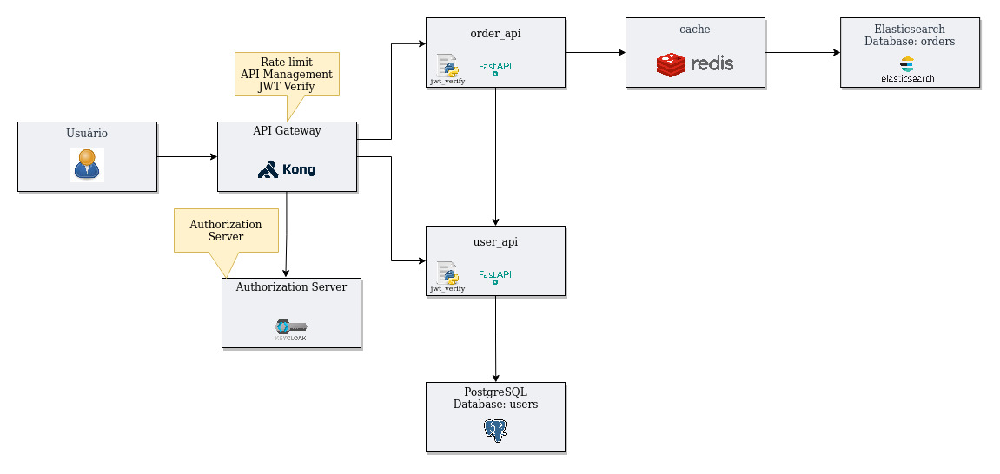
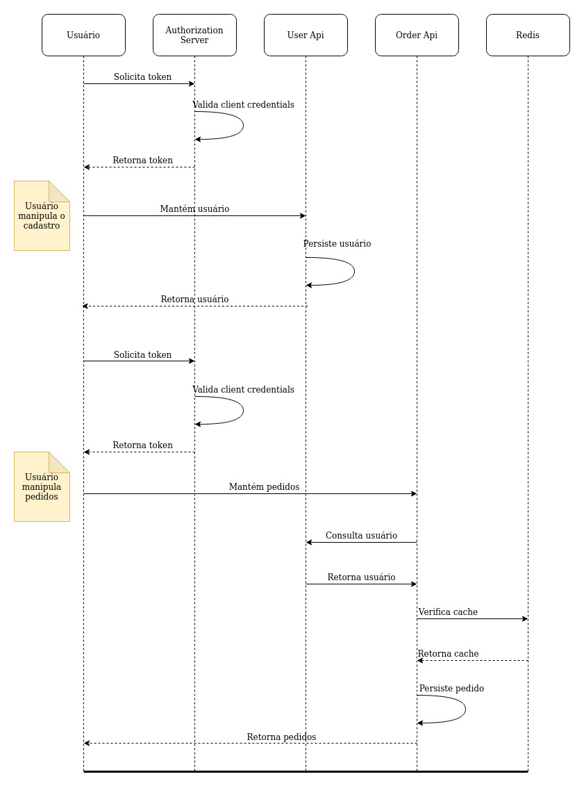

# Serasa Consumidor - Teste para analista desenvolvedor

O ecossistema é composto por dois microsserviços:

* [order-api](order-api)
* [user-api](user-api)

O primeiro microsserviço mantém pedidos, enquanto o segundo mantém usuários. Os microsserviço de usuários foi desenvolvido utilizando `sqlalchemy` já o microsserviço de pedidos foi utilizada uma liberdade filósofica maior, utilizando-se de conceitos de OO para criar uma API de interação com o banco de dados `Elasticsearch`.

O projeto não segue a risca os conceitos de `Clean Architecture`, no entanto, tenta ao máxima seguir a sua filosofia, uma vez que possuí de forma desacoplada seus módulos, classes e métodos.

Na pasta [architecture](architecture) podem ser encontrados desenhos técnicos dos banco de dados pensados, da sua modelaem e da arquitetura do sistema como um todo. Serve também como uma visão geral do que o sistema é e o que executa.

## Arquitetura

Para garantir a segurança da aplicação, o [Kong](https://konghq.com/kong/) foi utilizado juntamente com o [Keycloak](https://www.keycloak.org/) de tal maneira que a raíz do _endpoints_ dos microsserviços apontariam para o `Kong` que através de um plugin com o `Keycloak` requisitaria um Single Sign On (Keycloak) gerando uma autenticação simples de usuário/senha e um [JWT](https://en.wikipedia.org/wiki/JSON_Web_Token) seria gerado e assinado pelo `Kong`. Assim o ecossitema da aplicação ficaria protegido contra terceiros mal intecionados.

A arquiterua abaixo exibe como se daria essa dinâmica.



Dentro da arquitetura foi pensada também uma camada de _cache_ com [Redis](https://redis.io/) em que as chamadas ao banco de dados do microsserviço de pedidos passaria primeiro pelo cache checando se o dados buscado já existe, evitando uma chamada desnecesária e custosa ao banco de dados.

A arquitetura proposta pode ser verificada em detalhes abaixo



## Documentação

Todo o código foi documentado utilizando `Sphinx`, é possível acessar a documentação técnica do projeto acessando os endpoints abaixo:

* [order-api](http://localhost:8000/)
* [user-api](http://localhost:7000/)

## Pré-requisitos

Para executar o projeto é preciso que [docker](https://docs.docker.com/) e o [docker-compose](https://docs.docker.com/compose/) estejam devidamente configurados, e que uma `SECRET_KEY` seja gerada. Para isto é possível utilizar a função [generate_key](user-api/user_api/utlis/cryptography.py) e exportar a chave como variável de ambiente com o nome `SECRET_KEY no terminal que vai executá-lo.

## Execução

Com o `docker`, `docker-compose` e a variável de ambiente `SECRET-KEY` exportada no seu terminal, basta executar:

```bash
make run
```

Para rodar o projeto completo, ou, caso deseje, é possível rodar cada microsserviço separadamente, desta maneira:

```bash
make user
```

Para rodar o microsserviço `user-api` e

```bash
make order
```

Para rodar o microsserviço `order-api`

## Estilo de código

Esse código segue o padrão PEP8 e pode ser testado com a biblioteca [PyLama](https://github.com/klen/pylama) como no exemplo a seguir

```bash
make lint
```

### Autoformatter

O projeto conta com o [Black](https://github.com/psf/black) que é um `autoformatter`, formatando o código caso exista algum trecho de código que não siga a PEP8. Para executá-lo basta rodar o seguinte comando no terminal:

```bash
make black
```

## Deploy

Com a aplicação _dockerizada_ e testada, é possível efetuar o _deploy_ em um orquestrador de _containers_ a exemplo do [Kubernetes](https://kubernetes.io/pt/), ou mesmo, com o orquestrador nativo do Docker [Swarm](https://docs.docker.com/engine/swarm/).

## Construído Com

* [black](https://github.com/psf/black)
* [loguru](https://github.com/Delgan/loguru)
* [Elasticsearch](https://www.elastic.co/elasticsearch/)
* [pydantic](https://pydantic-docs.helpmanual.io)
* [fastapi](https://fastapi.tiangolo.com)
* [uvicorn](https://www.uvicorn.org)
* [gunicorn](https://gunicorn.org)
* [requests](https://requests.readthedocs.io/en/master/)
* [sphinx](https://www.sphinx-doc.org/en/master/)

## Versionamento

O versionamento segue o padrão do [Versionamento Semântico](http://semver.org/).

## License

Todos os direitos são reservados ao autor Kevin de Santana Araujo.

## Outras informações

* Caso tenha alguma dúvida em relação ao projeto, ou queira contribuir com sugestões ou críticas, abra uma [issue]() ou procure o desenvolvedor através do email kevin_santana.araujo@hotmail.com
