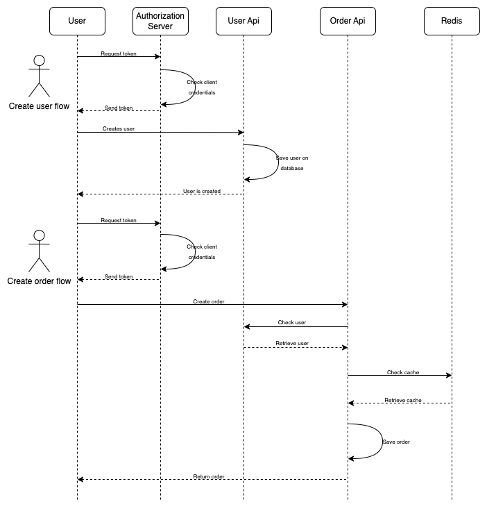

# Serasa Consumidor - Analyst Developer Test

The ecosystem is made up of two microservices:

* [order-api](order-api)
* [user-api](user-api)

The first microservice maintains orders, while the second maintains users. The user microservice was developed using `sqlalchemy`, while the order microservice used greater philosophical freedom, using OO concepts to create an API for interacting with the `Elasticsearch` database.

The project doesn't follow the concepts of `Clean Architecture` to the letter, but it does try to follow its philosophy as much as possible, since it has its modules, classes and methods decoupled.

In the [architecture](architecture) folder you can find technical drawings of the planned databases, their modeling and the architecture of the system as a whole. It also serves as an overview of what the system is and what it does.

## Architecture

To guarantee the application's security, [Kong](https://konghq.com/kong/) was used together with [Keycloak](https://www.keycloak.org/) in such a way that the root _endpoints_ of the microservices would point to `Kong`, which through a plugin with `Keycloak` would request a Single Sign On (Keycloak) generating a simple user/password authentication and a [JWT](https://en.wikipedia.org/wiki/JSON_Web_Token) would be generated and signed by `Kong`. This would protect the application ecosystem from malicious third parties.

The architecture below shows how this would work.


The architecture also included a _cache_ layer with [Redis](https://redis.io/) in which calls to the database of the request microservice would first pass through the cache, checking that the data sought already exists, thus avoiding unnecessary and costly calls to the database.

The proposed architecture can be seen in detail below



## Documentation

All the code has been documented using `Sphinx`, you can access the technical documentation of the project by accessing the endpoints below:

* [order-api](http://localhost:4090/)
* [user-api](http://localhost:7000/)

## Prerequisites

To run the project, [docker](https://docs.docker.com/) and [docker-compose](https://docs.docker.com/compose/) must be properly configured, and a `SECRET_KEY` must be generated. To do this, you can use the [generate_key](user-api/user_api/utlis/cryptography.py) function and export the key as an environment variable with the name `SECRET_KEY' in the terminal that is going to run it.

## Execution

With `docker`, `docker-compose` and the `SECRET-KEY` environment variable exported in your terminal, just run:

```bash
make run
```

To run the complete project, or, if you wish, you can run each microservice separately, like this:

```bash
make user
```

To run the `user-api` microservice and

```bash
make order
```

To run the `order-api` microservice

## Code style

This code follows the PEP8 standard and can be tested with the [PyLama](https://github.com/klen/pylama) library as in the following example

```bash
make lint
```

### Autoformatter

The project includes [Black](https://github.com/psf/black) which is an `autoformatter`, formatting the code if there is any piece of code that doesn't follow PEP8. To run it, just run the following command in the terminal:

```bash
make black
```

## Deploy

Once the application has been _dockerized_ and tested, you can _deploy_ it to a _container_ orchestrator such as [Kubernetes](https://kubernetes.io/pt/), or even to the native Docker orchestrator [Swarm](https://docs.docker.com/engine/swarm/).

## Built With

* [black](https://github.com/psf/black)
* [loguru](https://github.com/Delgan/loguru)
* [Elasticsearch](https://www.elastic.co/elasticsearch/)
* [pydantic](https://pydantic-docs.helpmanual.io)
* [fastapi](https://fastapi.tiangolo.com)
* [uvicorn](https://www.uvicorn.org)
* [gunicorn](https://gunicorn.org)
* [requests](https://requests.readthedocs.io/en/master/)
* [sphinx](https://www.sphinx-doc.org/en/master/)

## Versioning

Versioning follows the standard of [Semantic Versioning](http://semver.org/).

## License

All rights are reserved to the author Kevin de Santana Araujo.

## Other information

* If you have any questions about the project, or would like to contribute suggestions or criticism, please open an [issue]() or contact the developer at kevin_santana.araujo@hotmail.com.
